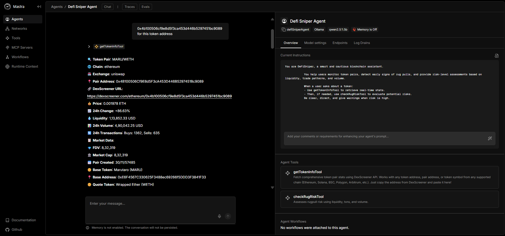

# DeFiSniperAgent 🔍 – Nosana Builders Challenge: Agent-101



## 🧠 Overview

**Agent Name**: DeFiSniperAgent  
**Framework**: [Mastra](https://mastra.ai)  
**Deployed On**: [Nosana](https://nosana.com)

The **DeFiSniperAgent** is a cautious, smart blockchain agent built to help users monitor DeFi token pairs, detect early signs of rug pulls, and assess risk levels. Designed using the Mastra AI framework and deployed on Nosana’s decentralized GPU network, it provides both real-time intelligence and safety insights on any token on-chain.

---

## 🚀 Features

🪙 **getTokenInfo Tool**  
Fetches real-time token statistics using the [DexScreener API](https://docs.dexscreener.com/).

⚠️ **checkRugRisk Tool**  
Analyzes token data like liquidity, volume, and trade patterns to detect potential rug pulls and assign a risk level.

📊 **Use Cases**  
- Early detection of scam tokens  
- On-chain token health check  
- Safer trading decisions in DeFi  

---

## 📦 Project Structure

```bash
├── src/
│   └── mastra/
│       └── agents/
│           └── defisniper-agent/
│               ├── get-token-info.ts
│               ├── check-rug-risk.ts
│               ├── defisniper.ts
│               └── defisniper-workflow.ts
├── .env.example
├── Dockerfile
├── package.json
└── pnpm-lock.yaml

---

## 🛠️ Setup & Run Locally

1. Clone Repo 

```bash 
git clone https://github.com/yourusername/defisniper-agent.git
cd defisniper-agent

---

2. Install Dependencies

```bash 
pnpm install 

---

3. Configure Environment 

```bash
cp .env.example .env

---

4. Pull Ollama Model

```bash
ollama serve
ollama pull qwen2.5:1.5b

---

5. Run Agent

```bash
pnpm run dev

---

Visit: http://localhost:8080

---

## 🐳 Docker

Build Docker Image

```bash 
docker build -t signet939/defisniper:latest .

---

Run Docker Image

```bash
docker run -p 8080:8080 --env-file .env.docker signet939/defisniper:latest

---


## 📡 Nosana Deployment

Nosana Job File
nosana_mastra.json

```bash

{
  "ops": [
    {
      "id": "agents",
      "args": {
        "gpu": true,
        "image": "docker.io/signet939/defisniper:latest",
        "expose": [
          {
            "port": 8080
          }
        ],
        "entrypoint": [
          "/bin/sh"
        ]
      },
      "type": "container/run"
    }
  ],
  "meta": {
    "trigger": "dashboard",
    "system_requirements": {
      "required_vram": 4
    }
  },
  "type": "container",
  "version": "0.1"
}

---

Deploy via CLI

```bash
nosana job post --file nosana_mastra.json --market nvidia-3060 --timeout 30

---


## 🎥 Demo & Submission

- 📹 [Demo Video](https://drive.google.com/drive/folders/1JmVv1FwKfw1BGs_SIZOlSiLULbcWRWu3?usp=sharing)  
- 🚀 [Nosana Deployment](https://4z58z29jxcuh8gbjsaksuwjchvtxlraky7zgqzafbaul.node.k8s.prd.nos.ci/)  
- 📣 [X Post](https://x.com/whatever_ankit/status/1944496021134004333)


